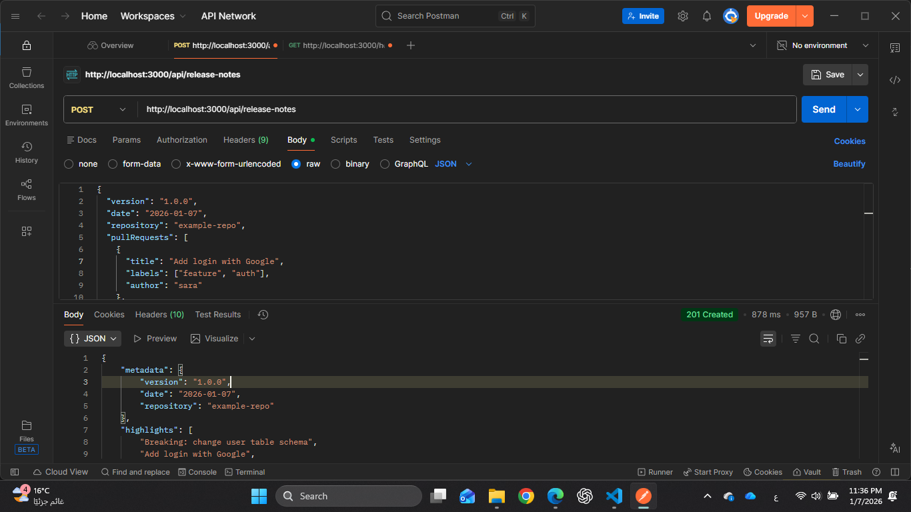
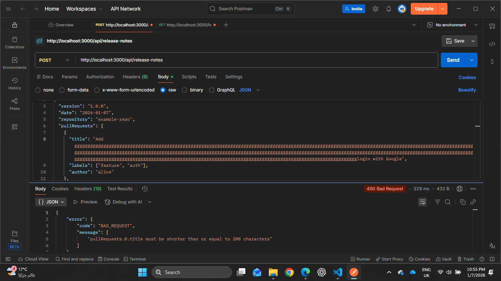

# Release Notes Generator API (NestJS + AI)

A Node.js backend service that generates structured release notes from a list of pull requests (PRs), with optional AI-enhanced highlights, risks/notes, and Markdown output.

---

## Overview

This API accepts release metadata and PR details, categorizes them into clear sections (Features, Improvements, Fixes, Breaking Changes), and returns:

* Structured JSON output
* A ready-to-publish Markdown release note

AI is used only to enhance highlights and risks when enabled, with safe fallbacks to deterministic logic.

---

## Key Features

* Generate release notes (JSON + Markdown) from PRs
* Automatic categorization of PRs by labels
* Optional AI-generated highlights and risks
* Safe fallback if AI output is invalid
* Input validation and basic rate limiting
* Designed for GitHub Releases and changelogs

---

## API Endpoint

### POST `/api/release-notes`

Generates release notes for a given release.

### Request Body Example

```json
{
  "version": "1.0.0",
  "date": "2026-01-07",
  "repository": "example-repo",
  "pullRequests": [
    {
      "title": "Add login with Google",
      "labels": ["feature", "auth"],
      "author": "sara"
    },
    {
      "title": "Fix crash on logout",
      "labels": ["bugfix"],
      "author": "omar"
    },
    {
      "title": "Breaking: change user table schema",
      "labels": ["breaking"],
      "author": "ali"
    }
  ]
}

```

### Response Example

```json
{
    "metadata": {
        "version": "1.0.0",
        "date": "2026-01-07",
        "repository": "example-repo"
    },
    "highlights": [
        "Breaking: change user table schema",
        "Add login with Google",
        "Fix crash on logout"
    ],
    "sections": {
        "features": [
            "Add login with Google"
        ],
        "improvements": [],
        "fixes": [
            "Fix crash on logout"
        ],
        "breakingChanges": [
            "Breaking: change user table schema"
        ]
    },
    "risksAndNotes": [
        "Review breaking changes carefully before deploying to production."
    ],
    "markdown": "## Release 1.0.0\n Date: 2026-01-07\n Repository: example-repo\n\n###  Features\n- Add login with Google\n\n###  Fixes\n- Fix crash on logout\n\n###  Breaking Changes\n- Breaking: change user table schema\n\n"
}
```

---

## How to Try the API

You can test the `/api/release-notes` endpoint using **Postman** or Windows PowerShell `Invoke-RestMethod`. Example JSON request body is shown above.

> Note: Using `curl.exe` on Windows PowerShell requires careful escaping of quotes. Postman is recommended for simplicity.

### Example Health Check

```powershell
Invoke-RestMethod -Uri http://localhost:3000/health -Method GET
```

Returns:

```json
{
  "status": "ok"
}
```

---

## Notes

* PR title max length: 200 characters
* Max PRs per request: 200
* AI output is retried once if invalid, then deterministic logic is used
* Logs include request ID and execution time (no sensitive data)

---

## Environment Variables

* `PORT=3000`
* `OPENAI_API_KEY=YOUR_KEY_HERE`
* `OPENAI_MODEL=YOUR_MODEL_HERE`
* `NODE_ENV=development`

---

## Setup & Run Locally

1. Install dependencies:

```bash
npm install
```

2. Create a `.env` file with the required environment variables.

3. Start the server:

```bash
npm run start
```

Server will run on `http://localhost:3000`.

## Screenshots
##God Request


##Bad Request



